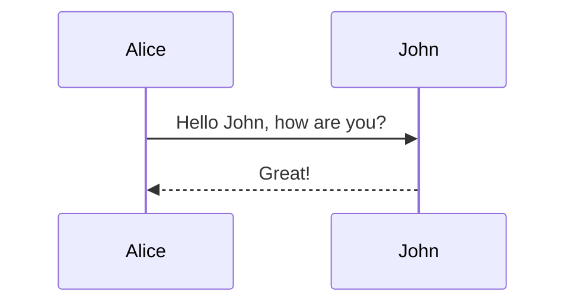

# Trust Bonds

Read more on our [public website](https://leomoura.org/trust-bonds).

### Important parts

- `/packages/contracts`: all contracts and tests (`@trust-bonds/contracts`)
- `/docs/index.html`: the public website for the project

### Documentation

The project documentation is built using [mdBook](https://rust-lang.github.io/mdBook/) and includes support for [Mermaid](https://mermaid.js.org/) diagrams. To use Mermaid diagrams in the documentation:

1. Write your diagram in a code block with the `mermaid` language specifier:



2. Run the documentation locally:

```bash
mdbook serve docs
```

### Apps and Packages

These are stubs that will be useful in the future when we develop a dApp.

- `docs`: a [Next.js](https://nextjs.org/) app with [Tailwind CSS](https://tailwindcss.com/)
- `ui`: a stub React component library with [Tailwind CSS](https://tailwindcss.com/) shared by both `web` and `docs` applications
- `@repo/eslint-config`: `eslint` configurations (includes `eslint-config-next` and `eslint-config-prettier`)
- `@repo/typescript-config`: `tsconfig.json`s used throughout the monorepo

### In progress

We are currently working on launching a test contract on testnet.

- [ ] Documentation
- [ ] Community funds
- [ ] Passport testnet
- [ ] Score calculation
- [ ] Upgrade typescript >= 5.4.0
- [ ] Replace deprecated eslint
